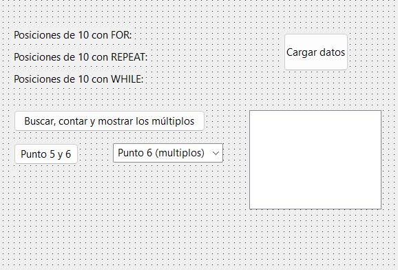

# Pascal: Laboratorio Técnico de Búsqueda Lineal Comparativa y Filtrado de Vectores Modulares

Este repositorio contiene un proyecto práctico de escritorio desarrollado en **Pascal** utilizando el entorno **Lazarus / Delphi** enfocado en el análisis algorítmico y control de estructuras iterativas. La aplicación inicializa arreglos lineales unidimensionales estáticos ($\text{tamaño } = 100$), inyecta valores enteros aleatorios mediante offsets y compara de forma directa la eficiencia estructural de los ciclos `for`, `while` y `repeat..until` al ejecutar tareas de localización exhaustiva de tokens y filtrado de múltiplos por congruencia modular.

---

## 📊 Interfaz Gráfica del Sistema

Para documentar el panel de comparación visual de las posiciones del vector, guarda la captura de pantalla de tu formulario en la raíz del repositorio con el nombre exacto de `interfaz_bucles.png`:



---

## ⚙️ Análisis de la Arquitectura de Bucles Comparativos

El código fuente en `src/Unit1.pas` implementa tres filosofías de exploración lineal sobre el arreglo indexado para resolver el problema de encontrar la posición del valor `10`:

### 1. Exploración Exhaustiva Total (`for..to..do`)
Recorre el vector de forma determinista desde la primera hasta la última posición ($1 \dots 100$). Registra e imprime de forma acumulativa **todas** las ubicaciones donde aparece el valor buscado, funcionando como un mapeador completo de frecuencias:
```pascal
for i := 1 to max do
begin
  if nums[i] = 10 then
     lbl_num10for.caption := lbl_num10for.caption + ' ' + inttostr(i) + ' ';
end;

```

### 2. Búsqueda con Post-Condición de Quiebre (`repeat..until`)

Garantiza al menos una evaluación lineal. Utiliza una estructura condicional que avanza el puntero de índice e interrumpe el ciclo de forma inmediata al detectar la **primera ocurrencia** del token o alcanzar el límite máximo del arreglo, optimizando los ciclos de procesamiento:

```pascal
i := 1;
repeat
  if nums[i] = 10 then
     // Bloque de captura atómica
  else
     i := i + 1;
until (nums[i] = 10) or (i > max);

```

### 3. Búsqueda con Pre-Condición de Entrada Estricta (`while..do`)

Evalúa los límites del subrango y la condición de identidad antes de procesar el bloque interno. Al igual que el esquema anterior, detiene el avance del puntero al encontrar el primer elemento coincidente, minimizando el costo computacional frente a búsquedas exhaustivas:

```pascal
i := 1;
while (i <= max) and (nums[i] <> 10) do
begin
  i := i + 1;
end;

```

---

## 🛠️ Conceptos Técnicos Aplicados

* **Aritmética de Múltiplos por Congruencia Modular (`mod`)**: Aplicación del operador de residuo `mod` para evaluar si el resto de una división entera es idéntico a cero, aislando de forma exacta los múltiplos de una variable introducida por consola o seleccionada en la GUI.
* **Manejo de Eventos por Índice de Lista (`ItemIndex`)**: Captura reactiva de la interacción del usuario sobre el componente `TListBox`. El sistema extrae el token numérico basado en la propiedad dinámica `.items[listbox_punto7.ItemIndex]` para recalcular dinámicamente las cadenas de múltiplos en tiempo de ejecución.
* **Normalización de Cadenas y Saltos de Línea (`#13#10`)**: Concatenación estructurada de hilos de texto utilizando los caracteres de control ASCII de retorno de carro (`#13`) y salto de línea (`#10`) para generar interfaces limpias y legibles dentro de componentes `TLabel`.
